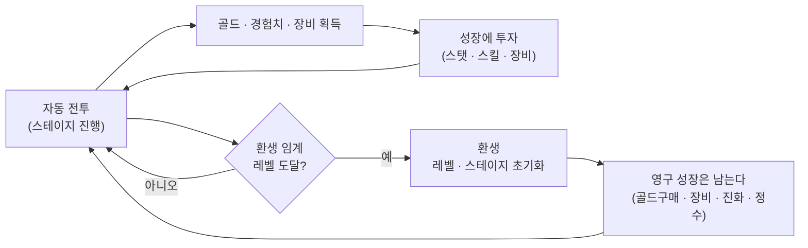
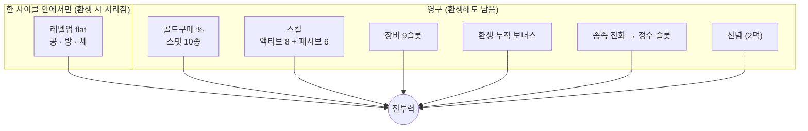
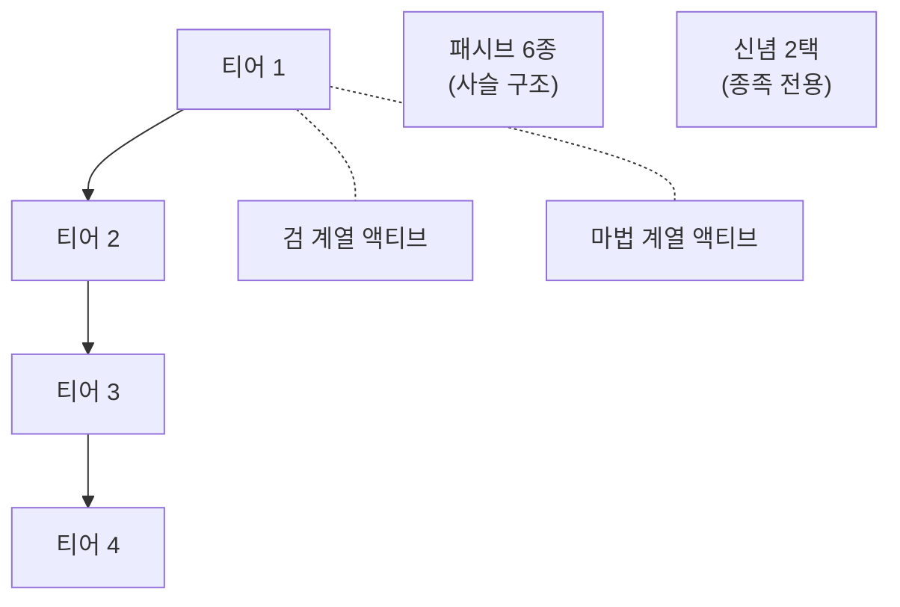
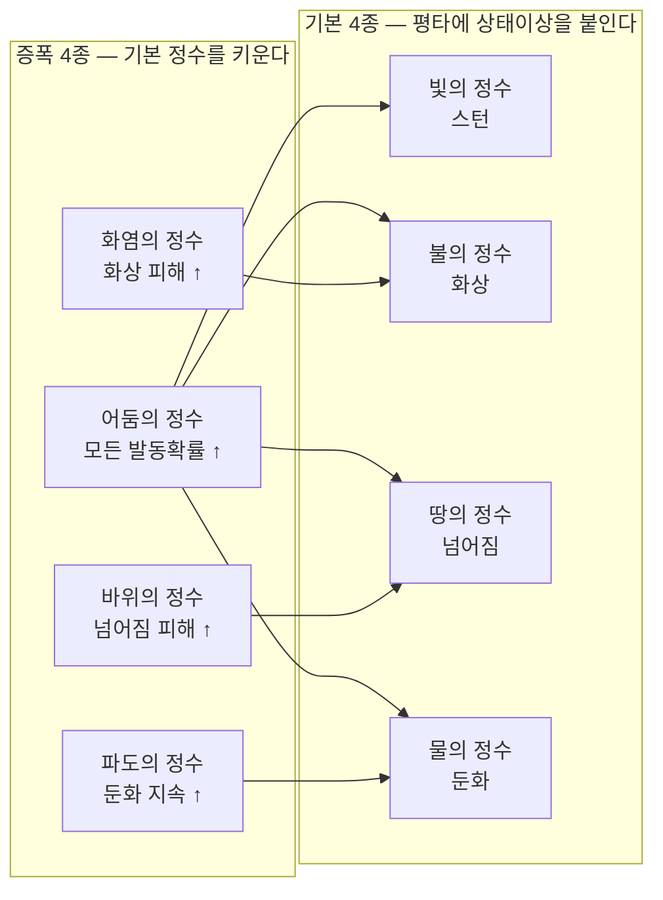
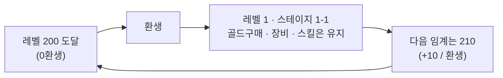
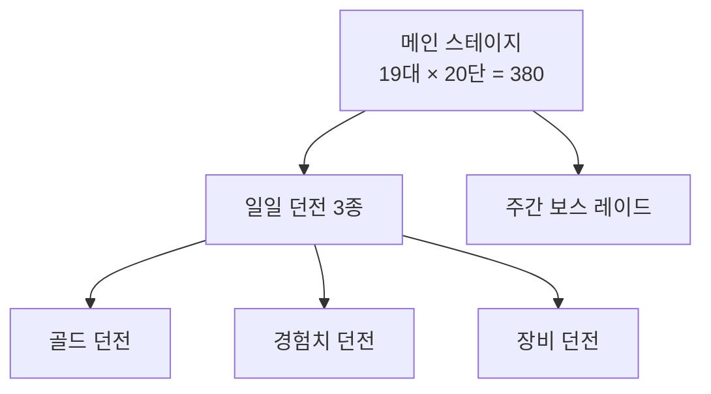
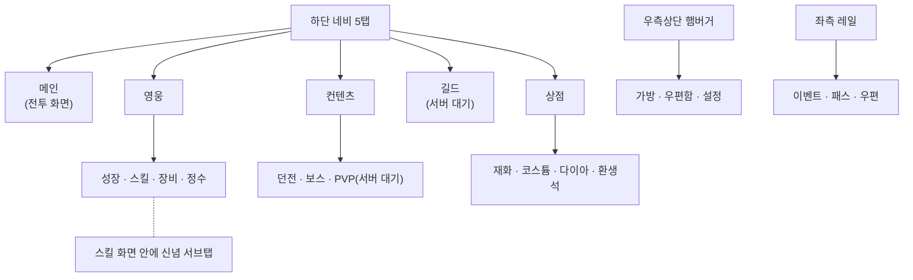

# GAME_OVERVIEW.md — 게임 전체 구도 (외부 공유용)

> **디자이너·외주 협업자에게 이 게임을 설명하기 위한 문서다.** 게임을 처음 보는 사람이
> 위에서 아래로 한 번 읽으면 구조가 잡히도록 썼다.
>
> 이 문서에 게임 수치의 **소유권은 없다**. 모든 수치의 소유자는
> [GAME_BALANCE.md](GAME_BALANCE.md)와 `docs/balance/` 하위 파일이며, 여기 적힌 값은
> 2026-09-08 기준 **스냅샷**이다. 값이 어긋나면 balance 쪽이 옳다.
>
> 에셋 규격은 [ASSET_SPEC.md](ASSET_SPEC.md)
>
> 최초 작성 2026-09-08.

---

## 1. 한 줄 요약

**세로 모바일 방치형(Idle) 키우기 RPG.** 플레이어는 **천족**과 **마족** 중 하나를 골라
자동으로 싸우는 캐릭터를 키우고, 벽에 막히면 **환생**해 처음부터 다시 오른다.

| 항목 | 값 |
|---|---|
| 플랫폼 | Android 우선 → iOS |
| 화면 | **세로 고정** 1080 × 1920 |
| 엔진 | Godot 4.7 (Mobile 렌더러) |
| 조작 | **자동 전투.** 플레이어는 성장에 자원을 어디에 쓸지만 고른다 |
| 목표 플레이 기간 | 최종 목표(19대스테이지 · 환생 80회 · Lv1000)까지 **약 415일** |
| 하루 기준 | 온라인 2시간 + 오프라인 보상 8시간(효율 80%) = 유효 8.4시간 |

**장르적으로 중요한 성질**: 플레이어는 대부분의 시간에 **화면을 보고만 있다.**
그래서 전투 연출·수치가 오르는 감각·화면의 밀도가 곧 재미다.

---

## 2. 핵심 루프



- **한 판**이 아니라 **한 사이클**이 단위다. 사이클 = 1-1에서 시작해 벽에 막힐 때까지.
- 환생하면 레벨과 스테이지는 1로 돌아가지만 **영구 성장은 남아서** 다음 사이클이 더 빠르다.
- 그 "더 빠름"이 쌓이는 것이 이 게임의 전체 성장이다.

---

## 3. 성장 축 — 7개

플레이어가 강해지는 경로다. **환생 때 사라지는 것과 남는 것이 갈린다** — 이 구분이
방치형의 핵심이다.

| 축 | 자원 | 환생 시 | 성격 |
|---|---|---|---|
| **레벨업 flat** | 경험치 | ❌ 초기화 | 공/방/체 고정값. 한 사이클의 주 엔진 |
| **골드구매 %** | 골드 | ✅ 영구 | 스탯 10종을 %로 올린다. 누적이 곧 파워 |
| **스킬** | 스킬포인트 · 환생석 | ✅ 영구 | 액티브 8 + 패시브 6 |
| **장비** | 드랍 · 강화석 · 전설의 핵 | ✅ 영구 | 9슬롯 × 4등급 |
| **환생 누적 보너스** | 환생 횟수 | ✅ 영구 | 환생할수록 자동으로 오른다 |
| **종족 진화** | 환생 횟수 | ✅ 영구 | 9단계. 칭호가 아니라 **정수 슬롯**을 준다 |
| **신념** | 1회 선택(재선택권) | ✅ 영구 | 종족별 2택 특수 패시브 |

> ⚠️ **칭호 시스템은 지금 꺼져 있다**(2026-09-07). 코드·화면이 그대로 남아 있고 데이터 한 값으로
> 되살아나지만, 현재 밸런스 기준은 위 7개다.

### 무엇이 얼마나 기여하는가 (개념도)



---

## 4. 전투

### 화면 구도

```
        ┌─────────────────────────── 1080 × 1920 (세로) ───────┐
        │  상단 HUD — 닉네임 · 레벨 · 재화 · 전투력             │
        │                                                       │
        │        [배경 3겹 시차 스크롤]                          │
        │                                                       │
        │                    🧍 플레이어                          │
        │              (화면 중앙, 세로 65% 지점)                 │
        │                                                       │
        │        👹  👹      👹        ← 몬스터가 반원으로 둘러싼다  │
        │              👹        👹        (최대 10마리)          │
        │                                                       │
        │  하단 네비 — 메인 · 영웅 · 컨텐츠 · 길드 · 상점         │
        └───────────────────────────────────────────────────────┘
```

- 몬스터는 **화면 밖에서 걸어 들어와** 플레이어를 **반원(180°)** 으로 둘러싼다.
- 플레이어는 제자리에서 가장 가까운 적을 때리고, 사거리를 벗어나면 걸어간다.
- 원근을 준다 — 뒤에 선 몬스터는 0.85배, 앞은 1.15배로 그린다.

### 전투 진행

| 요소 | 값 |
|---|---|
| 평타 | **초당 2회**(환생마다 +1%씩 빨라진다) |
| 스킬 | 액티브 4슬롯 자동 발동(쿨타임 3.5~12초) |
| 동시 등장 몬스터 | 최대 10마리 |
| 보스 | **20단마다 한 번**. 일반 몬스터의 **4.76배** 크기로 화면 우측 3/4 지점에 등장, 1.5초 등장 연출 |
| 스킬 : 평타 데미지 비중 | **4 : 1** |

### 데미지 계산 (단순화)


### 상태이상 4종

플레이어 → 몬스터 **단방향**이다(몬스터는 스킬이 없다).

| 상태이상 | 유형 | 효과 |
|---|---|---|
| **화상** | 지속 피해 | 매초 대상 최대체력의 %, 최대 3스택 |
| **둔화** | 방해 | 몬스터 공격 주기 증가 |
| **스턴** | 행동불가 | 1초 고정 |
| **넘어짐** | 행동불가 + 증폭 | 그 대상이 **받는 피해 증가** |

- 부여 경로 둘: **스킬 발동 시**(스킬마다 종류·확률이 다르다) · **평타 명중 시**(정수)
- **보스는 저항한다** — CC 3종은 지속시간 95% 감소, 화상은 틱 데미지 95% 감소

---

## 5. 스킬

### 구조



| 항목 | 값 |
|---|---|
| 액티브 | **8종** (티어 1~4 × 검/마법 2계열) |
| 장착 슬롯 | **4개** — 8종 중 4개만 쓴다(선택이 곧 빌드) |
| 패시브 | **6종**, 사슬로 이어져 순서대로 열린다 |
| 레벨 | **무한 레벨링**. 마일스톤(5·10·15·20·30·50)에서 효과가 점프 |
| 비용 | 스킬포인트(10레벨마다 1개) + 마일스톤마다 환생석 1개 |

### 계열 설계

- **검 계열** = 물리적 제어 → 넘어짐 · 스턴
- **마법 계열** = 지속·광역 저해 → 화상 · 둔화
- 같은 티어의 검/마법이 서로 다른 상태이상을 가져 **로드아웃 선택에 의미**를 준다.
- 천족·마족은 **이름과 연출만 다르고 수치는 완전히 동일**하다.

### 액티브 8종 (천족 / 마족)

| 티어 | 계열 | 천족 | 마족 | 상태이상 |
|---|---|---|---|---|
| 1 | 검 | 성광참 | 혈참 | 넘어짐 15% |
| 1 | 마법 | 빛의 창 | 혈마탄 | 화상 30% |
| 2 | 검 | 심판의 원무 | 광기의 원무 | 넘어짐 20% |
| 2 | 마법 | 성역 폭발 | 어둠의 폭발 | 둔화 40% |
| 3 | 검 | 천벌 | 마신강림 | 스턴 25% |
| 3 | 마법 | 심판의 빛 | 심연의 낙인 | 화상 50% |
| 4 | 검 | 종말의 성검 | 종말의 마검 | 넘어짐 40% |
| 4 | 마법 | 신의 계시 | 멸망의 서약 | 둔화 60% |

### 신념 (종족 전용 1택)

| 종족 | 선택지 A | 선택지 B |
|---|---|---|
| 천족 | **신의 개입** — 한 번에 최대체력 30% 초과 피해를 받으면 초과분 무효 | **빛의 축복** — 체력 50% 이하일 때 초당 최대체력 2% 회복 |
| 마족 | **포식** — 가한 최종데미지의 5% 흡혈 | **광기** — 잃은 체력에 비례해 공격력 증가(최대 +50%) |

---

## 6. 정수 (Essence) — 최신 시스템

종족 진화로 슬롯이 열리고, 뽑기로 얻는다. **평타에 상태이상을 붙이는 것**이 역할이다.

| 항목 | 값 |
|---|---|
| 슬롯 | 0환생 **1개** → 진화 단계마다 +1 → 100환생 **9개** |
| 획득 | 뽑기(누적 1,000마리 처치당 무료 1회 / 다이아 200) |
| 등급 | 노말 · 희귀 · 에픽 · 전설 (전설 0.1%) |

### 8종 — 기본 4 + 증폭 4



| 정수 | 효과 (노말 → 전설) |
|---|---|
| 빛의 정수 | 2~8% 확률로 **1초 스턴** |
| 불의 정수 | 2~8% 확률로 2~3초간 **초당 최대체력 1~2.5% 화상** |
| 땅의 정수 | 2~8% 확률로 1~2초간 **넘어짐**(받는 피해 +20%) |
| 물의 정수 | 2~8% 확률로 1~2초간 **둔화**(공격속도 −50%) |
| 어둠의 정수 | 모든 정수 발동확률 **+10~100%** |
| 화염의 정수 | 화상 피해 **+10~100%** |
| 바위의 정수 | 넘어짐 받는 피해 **+10~100%** |
| 파도의 정수 | 둔화 지속시간 **+10~80%** |

> ⚠️ **증폭 정수는 단독으로는 아무 효과가 없다** — 대응하는 기본 정수가 있어야 한다.
> 이것이 이 시스템의 의도된 선택 압력이자, 동시에 아직 검토 중인 리스크다.

---

## 7. 장비

| 항목 | 값 |
|---|---|
| 슬롯 | **9개** — 머리 · 상의 · 하의 · 장갑 · 신발 · 무기 · 목걸이 · 반지 ×2 |
| 등급 | 노말 · 희귀 · 에픽 · **전설** |
| 성장 | 강화(레벨) · 승급(등급 상승) · **성급**(전설만, 0~10성) · 옵션 리롤 |
| 획득 | 몬스터 드랍 · 장비 던전(전설의 핵) |
| 등급별 옵션 | 노말/희귀 = 고정 스탯만 / 에픽 = 옵션 1줄 / **전설 = 옵션 2줄 + 성급** |

> 전설 장비는 **분해할 수 없다**(실수 방지). 9슬롯 전부 10성은 던전 진행도에 따라
> **0.9~2.7년**짜리 최종 목표다.

---

## 8. 스탯 10종

| 계열 | 스탯 | 반영 방식 |
|---|---|---|
| 곱연산 | 체력 · 공격력 · 방어력 | `기본값 × (1 + 합계%)` |
| 곱연산 | 크리티컬피해 · 골드획득 · 경험치획득 | 같음 |
| 가산 | 크리티컬확률 · 회피율 · 명중 · 관통율 | `기본값 + 수치` |

- **크리티컬확률에는 상한이 있다**(골드구매 누적 150%). 그 위는 구매 비용이 급격히 비싸진다.
- 회피 · 명중은 **보스 레이드와 PVP에서만** 쓰인다(일반 전투는 항상 명중).

---

## 9. 환생



| 항목 | 값 |
|---|---|
| 환생 임계 레벨 | **200 + 10 × 환생 횟수** (r0=200, r10=300, r80=1000) |
| 레벨 상한 | **= 임계 레벨**. 즉 환생하지 않으면 더 오를 수 없다 |
| 초기화되는 것 | 레벨 · 경험치 · 스테이지 |
| 유지되는 것 | 골드구매 % · 스킬 · 장비 · 정수 · 신념 · 재화 · 누적 통계 |
| 보상 | **환생석**(스킬 마일스톤 재화) |

**종족 진화 9단계** — 환생 횟수 0 / 1 / 5 / 10 / 20 / 30 / 50 / 70 / 100에서 오른다.

| 단계 | 천족 명칭 | 정수 슬롯 |
|---|---|---|
| 0 | 등급없음 | 1 |
| 1 | 최하급 천족 | 2 |
| 2 | 하급 천족 | 3 |
| 3 | 중급 천족 | 4 |
| 4 | 상급 천족 | 5 |
| 5 | 고위 천족 | 6 |
| 6 | 대천사 | 7 |
| 7 | 천사장 | 8 |
| 8 | 주신 | 9 |

---

## 10. 컨텐츠



### 메인 스테이지

| 항목 | 값 |
|---|---|
| 구조 | **19 대스테이지 × 20 단** = 380 스테이지 (표기 `3-15`) |
| 보스 | 각 대스테이지의 **20번째** 한 번 |
| 배경 | **10 세트** × 3겹 시차 스크롤. 대스테이지마다 로테이션 |
| 몬스터 외형 | 스테이지 1~18에 **18종**을 하나씩. 19 이상은 18번을 계속 쓴다 |
| 보스 외형 | **10종** — 그 스테이지의 배경 세트와 1:1 |

### 일일 던전 3종

| 던전 | 목표(제한 100초) | 보상 | 특징 |
|---|---|---|---|
| **골드** | 골드상자 30마리 | 골드 대량 | 상자는 반격하지 않는다 |
| **경험치** | 보스 1마리 | 경험치 대량 | 실제로 공격한다 |
| **장비** | "벽" 1개(보스 체력 ×2) | **전설의 핵** | 벽은 반격하지 않는다 |

- 입장 **일 3회** + 광고 2회 + 열쇠 구매 2회 = 최대 7회
- 10단계, **캐릭터 성장과 무관하게 강도 고정** → 진행도 자체가 목표
- 요일별 개방(월·목 골드 / 화·금 경험치 / 수·토 장비 / 일 전체)
- 이미 클리어한 단계는 **소탕**(전투 생략) 가능

### 주간 보스 레이드

| 항목 | 값 |
|---|---|
| 형식 | 90초 안에 누적 데미지를 최대한 쌓는 **데미지 체크** |
| 도전 | 주 3회 + 광고 3회 + 유료 도전권 |
| 보스 | 4티어(환생 0 / 5 / 10 / 20에 해금) |
| 보상 | 구간(체력 10%씩) 돌파 보상 + 랭킹(서버 대기) |
| 특수 | **명중/회피 상대 공식**이 여기서만 켜진다 |

---

## 11. 재화

| 재화 | 획득 | 사용 |
|---|---|---|
| **골드** | 몬스터 드랍 · 골드 던전 | 스탯 % 구매(영구) |
| **경험치** | 몬스터 · 경험치 던전 | 레벨업 |
| **다이아** | 일일 미션 · 패스 · 결제 | 정수 뽑기 · 열쇠 · 도전권 · 상점 |
| **스킬포인트** | 10레벨마다 1개 | 스킬 레벨업 |
| **환생석** | 환생 | 스킬 마일스톤 |
| **강화석** | 드랍 · 분해 · 상점 | 장비 강화 |
| **전설의 핵** | 장비 던전 | 전설 장비 제작 |
| **정수파편** | 정수 처분 · 뽑기 | 등급 확정 교환 |
| **정수 뽑기권** | 누적 1,000마리 처치 | 정수 뽑기 |

### 수익 모델

| 상품 | 내용 |
|---|---|
| 다이아 | **5단계**(1천 / 5천 / 1만 / 5만 / 10만) — ⚠️ 아트는 4장을 공유한다 |
| 패키지 | 초보자 · 성장 지원 · 스페셜 (**내용물 미확정**) |
| 패스 | **5종** — 스테이지·레벨·환생 마일스톤 달성분을 **소급 지급** |
| 편의 | 던전 열쇠 · 보스 도전권 · 광고 제거 · 닉네임 변경권 · 신념 재선택권 |
| 소모품 | 일일 골드 상자 · 강화석 상자 · 경험치 물약(1시간) |
| 환생석 교환 | 골드 · 강화석 · 전설의 핵 · 다이아 |
| 코스튬 | 외형 전용(무기 외형 포함). **시스템 미구현 — 진열만** |

---

## 12. 화면 구조



**기능 해금** — 처음부터 전부 열려 있지 않다. 스테이지를 클리어하며 하나씩 열린다.

| 해금 | 조건 |
|---|---|
| 성장 | 1-1 클리어 |
| 스킬 · 신념 | 1-10 클리어 + 스킬포인트 1개 이상 |
| 장비 | 1-15 클리어 |
| 던전 | 2-10 클리어 |
| 상점 | 3-10 클리어 |
| 보스 | 4-10 클리어 |
| 길드 | 4-20 클리어 |
| PVP | 5-10 클리어 |

---

## 13. 아트 방향 (현재 확정된 것)

디자이너가 가장 먼저 알아야 하는 부분이다. **규격은 [ASSET_SPEC.md](ASSET_SPEC.md)가 소유한다.**
(색상코드 / 테마 등 전부 바꿔도 무관. 현재 가지고 있는 색상코드 표기해둔 것)

### UI — 크림/양피지 톤

| 역할 | 색 |
|---|---|
| 화면 바탕 | `#faf6ee` |
| 패널 | `#f1e9de` (테두리 `#dfd3c2`) |
| 눌린 패널 | `#ded4c6` |
| 본문 글자 | `#3c2a1b` (진한 갈색 — 검정이 아니다) |
| 보조 글자 | `#7a6a58` |
| 강조(금색) | `#ecb23a` |
| 강조(보라) | `#8244d4` |
| 경고/위험 | `#e0482d` |
| 긍정 | `#4fbf6a` |
| 다이아 | `#2182ec` |

- **테두리보다 그림자로 띄운다** — 카드·팝업 모두 같은 규칙.
- 폰트는 **메이플스토리(Bold / Light)** 번들.

### 캐릭터 — 두 종족, 같은 실루엣 규격

| | 천족 | 마족 |
|---|---|---|
| 컨셉 | 빛 · 금색 · 헤일로 | 잉크 · 진홍 · 찢김 |
| 이펙트 핵심색 | `#ffe69e` 계열 | `#ff334d` 계열 |
| 이펙트 림색 | 차가운 흰-청 | 자-보라 |
| 지면 오라 | 금빛 | 붉은빛 |

- 캐릭터는 **무조건 여성**이다(성별 개념 자체가 코드에 없다). 남성 컨셉은 **코스튬 상품**.
- **무기는 캐릭터 그림에 함께 그린다**(런타임 부착 없음). 무기 외형은 코스튬이 소유한다.
- 두 종족은 **모션 규격이 완전히 같아야** 한다 — 프레임 수·크기·접지선이 어긋나면
  종족을 바꿀 때 캐릭터가 커졌다 작아진다.

### 이펙트 — 색은 데이터가 정한다

시트는 **무채색(흰빛)** 으로만 그린다. 종족 색은 코드 데이터(`.tres`)가 곱해서 입힌다 —
그래서 **시트 한 장이 두 종족을 덮는다**. 텍스처에 색을 구우면 종족 색 규칙이 두 곳으로 갈라진다.

---


| [SPEC.md](SPEC.md) | 기능 명세 |
| [ARCHITECTURE.md](ARCHITECTURE.md) | 코드 구조 |
| [PLAN.md](PLAN.md) · [TODO.md](TODO.md) | 진행 계획 · 남은 작업 |
| [CHANGELOG.md](CHANGELOG.md) | 구현 이력과 그 근거 |
